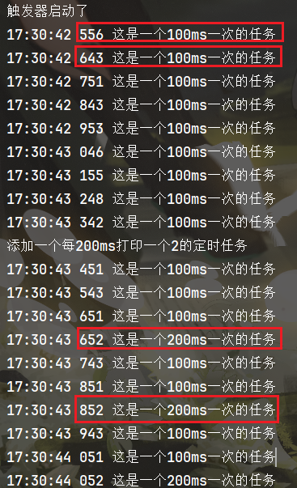

# mini-schedule

手写一个简单的mini定时任务

blog链接：[⏰ 实现简单mini的定时任务 | Blog](https://scmrcore.github.io/Notes/CodeMemoirs/手写定时任务.html)

- 涉及知识点：多线程，并发安全，优先队列，LockSupport
- 文件结构：


```powershell
mini-schedule
├── src
│   ├── main
│      ├── java
│      │   └── com.example.minischedule
│      │       ├── Job.java	#任务类
│      │       ├── MiniScheduleApplication.java #mian函数，跑样例
│      │       └── ScheduleService.java #核心schedule
│      └── resources
│          └── application.yml
├── pom.xml
```

- 执行结果：基本符合

	